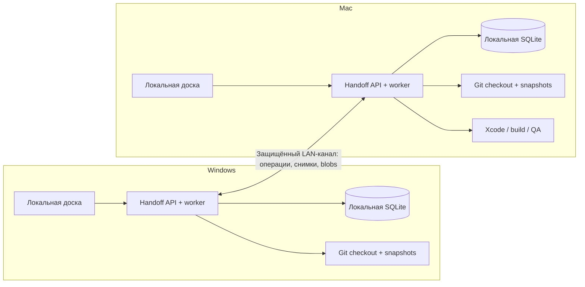

# ТЗ: персональный Handoff между Windows и Mac

> [План реализации](../plans/personal-lan-handoff.md) · [Запуск другой сессии](personal-lan-handoff-session.md) · [Инвентаризация проектов](personal-lan-handoff-projects.json)

Статус: подготовлено для реализации; перечисленные ниже новые возможности ещё не реализованы. Дата исследования: 2 октября 2026. База — пользовательский форк [Two-Faces/aif-handoff](https://github.com/Two-Faces/aif-handoff), локально `E:\Projects\aif-handoff`, ветка `main`, исходный коммит `3d982ef344aaa2fb72f99d5603a1fea0051206ea`. Пути к исходникам ниже указаны относительно корня этого репозитория. Перед реализацией проверить актуальную ревизию.

## 1. Задача пользователя

Доработать собственный форк Handoff, чтобы на Windows и Mac были одни и те же доски проектов, планы, контекст продолжения и результаты работы. Оба устройства работают автономно; при встрече в локальной сети обмениваются накопленными изменениями. Постоянно включённого сервера нет.

Пользователь уже импортировал историю Claude в Codex и перенёс проектный контекст в репозитории. Теперь нужен рабочий процесс разработки: выбрать задачу, работать на подходящем устройстве, сохранить результат и продолжить на другом. Локальные коммиты входят в этот процесс; push в GitHub/GitLab пользователь выполняет вручную после проверки.

Первый релиз рассчитан на одного владельца и два доверенных устройства. При этом разные задачи одного проекта могут выполняться одновременно на разных устройствах в отдельных рабочих копиях. Одну задачу одновременно исполнять на двух устройствах нельзя.

## Requirements Reconciliation

| Источник | Требование / обнаруженное поведение | Решение для этой доработки |
| --- | --- | --- |
| Текущий запрос | Собственный форк служит базой | Развивать существующие пакеты, доску, MCP и runtime; сохранять совместимость обычного локального режима |
| Ответ пользователя | Автономная работа, обмен при встрече в LAN | Две локальные БД и надёжный обмен доменными операциями; без обязательного центрального сервера |
| Процесс пользователя | Ассистент коммитит, пользователь проверяет и пушит | Персональный режим `publicationPolicy=local_only`; никакого автоматического push/PR, включая старые обходные пути публикации |
| Существующая архитектура | SQLite, Hono, React, отдельный data layer | Сохранить модульный монолит; доступ к БД только через `@aif/data` |
| Существующая «bidirectional sync» | AI Factory ↔ одна БД через MCP | Сохранить; добавить отдельный обмен между устройствами, не считать текущий timestamp resolver протоколом LAN |
| Существующая ownership | `executionOwner=ai|human`, participant assignments | Сохранить; добавить отдельные право исполнения на устройстве и номер поколения исполнения |
| Существующее завершение | `done` и `verified` — разные состояния | Проверки Mac должны относиться к текущему снимку кода и участвовать в переходе к `verified` |
| Инициализация проектов | Регистрация может запускать init, установку и Git-действия | Ввести подключение существующего проекта без изменения файлов; подготовка окружения — отдельное действие |
| Старая commit-логика | В prompt есть `git add -A` | Заменить детерминированным сохранением только изменений задачи; prompt сам по себе не гарантирует изоляцию |
| Примеры пользователя | Electron/macOS и мобильные эмуляторы | Проверять реальные возможности устройства; для iOS Simulator нужен Mac/Xcode, Android Emulator не ограничен Mac |

Приоритет: явные требования пользователя → применимые `AGENTS.md`/правила репозитория → проверенный текущий код → старые roadmap и планы. Изложенная архитектура является предлагаемым техническим решением; названия новых таблиц и API уточняются при реализации с сохранением обязательных инвариантов.

## 2. Пользовательские сценарии

### 2.1. Продолжение одной задачи на другом устройстве

1. На Windows пользователь подключает существующий проект, создаёт задачу и начинает работу через Codex вручную или через существующий worker Handoff.
2. Действие «Передать на Mac» останавливает исполнение, сохраняет относящиеся к задаче изменения локальными коммитами и создаёт пакет продолжения.
3. Пока Mac недоступен, задача показывает ожидающую передачу; Windows может выполнять другие задачи. Текущее право исполнения нельзя самовольно восстановить после его окончательного relinquish.
4. После соединения Mac получает доску, нужные Git-объекты и контекст; проверяет снимок, рабочую копию, необходимые инструменты и принимает переданное право.
5. На Mac открывается новая локальная сессия с кратким контекстом и точным снимком кода. Продолжение запускается явным действием пользователя или ранее включённой политикой worker, а не фактом получения данных.

### 2.2. Реализация Windows → сборка Electron на Mac

Создать родительскую задачу функции и связанные задачи реализации, macOS build/signing и QA. Реализация выдаёт снимок A; Mac собирает и проверяет именно A. Доска различает «код готов» и «обязательная проверка ещё не выполнена». После изменения кода до B успех проверки A остаётся в истории, но больше не закрывает требование для B.

Для выбранного профиля macOS требовать нативный Mac с проверенным toolchain и, если задача включает подпись, локально настроенным signing. Не делать общее утверждение, что любые Electron-артефакты невозможно собрать вне Mac: ограничения зависят от native dependencies и подписи. [Первичный источник electron-builder](https://github.com/electron-userland/electron-builder/blob/master/website/docs/features/multi-platform-build.md).

### 2.3. Мобильная версия

Связать задачу реализации с проверкой на выбранной платформе. Профиль `ios_simulator` требует нативную macOS-среду, Xcode и доступный simulator runtime; профиль `android_emulator` проверяет Android SDK, эмулятор и аппаратную виртуализацию на конкретном устройстве. Linux-контейнер на Mac не заменяет нативную среду Xcode. [Apple](https://developer.apple.com/xcode/system-requirements), [Android](https://developer.android.com/studio/run/emulator).

### 2.4. Работа без общей сети

Windows и Mac редактируют свои задачи и доски независимо. Уже выданное право исполнения остаётся у назначенного устройства. При встрече синхронизируются изменения; конфликты показываются человеку. Отсутствие peer heartbeat означает неизвестную доступность, а не разрешение присвоить чужую задачу. Локальная доступность доски не означает, что облачная модель может работать без интернета.

## 3. Границы релиза

Включить: общие доски, безопасное подключение всех имеющихся проектов, двустороннюю LAN-синхронизацию, committed Git snapshots, перенос проектного контекста, явный handoff, профили устройства, связанные build/QA-задачи и проверку конкретной версии кода.

Отложить: облачный relay, совместное редактирование документа в реальном времени, командную offline RBAC-модель, автоматический аварийный захват задачи у недоступного владельца, полноценные WIP-снимки staged/unstaged/untracked, автоматическое объединение divergent Git-веток и отдельную Electron-оболочку для самого Handoff.

Первый рабочий срез: два нативных локальных запуска Handoff и ручное подключение peer; существующий React-интерфейс открывается локально. mDNS-обнаружение и автоматический reconnect добавляются поверх устойчивого ручного обмена. Старый standalone/Docker-режим должен продолжать работать; macOS build/Simulator запускаются через нативный host executor.

## 4. Архитектура и распределение данных

Не копировать работающую SQLite по сети и не размещать её в общем сетевом каталоге: WAL рассчитан на локальные процессы одного хоста. Каждое устройство хранит свою БД и получает изменения через протокол приложения. [SQLite WAL](https://sqlite.org/wal.html).

| Общие данные | Локальные данные устройства |
| --- | --- |
| Стабильные project/task IDs, название проекта, задачи, планы, комментарии, порядок доски | Абсолютные корни проектов и worktree, Windows/WSL/container path mapping |
| Связи задач, требования платформы, grant права исполнения, история передач | PID/process handles, local claims/heartbeats, runtime readiness, resource slots |
| Снимки кода, context manifests, результаты проверки, artifact descriptors | Сессионные ID и resume handles Codex/Claude, локальные индексы истории |
| Доменные операции, tombstones, сохранённые варианты конфликтов | Учетные данные, peer private keys, MCP tokens, participant sessions/passwords |

Результат запуска реплицировать как неизменяемую запись с `runId`; локальную живую runtime-сессию не реплицировать. Не пересчитывать usage/cost при повторной доставке; в первом релизе локальная статистика может остаться локальной.

## 5. Идентичность проектов и подключение

Общий `projectId` не зависит от пути, ветки и имени устройства. Добавить локальное соответствие `(projectId, deviceId, checkoutId) → localRoot, executionEnvironment`. На Windows один проект может иметь native checkout и WSL checkout; на Mac — свои пути. Windows-путь никогда не используется как путь исполнения на Mac.

Режим `attach_existing`:

- Проверяет существующий Git-репозиторий, включая `.git`-файл worktree; читает HEAD, ветку и наличие контекста.
- Записывает только регистрацию в Handoff. Не делает git init/fetch/pull/checkout, npm/npx, commit, init AI Factory или переписывание `AGENTS.md`.
- Отдельно предлагает присоединить checkout к уже известному общему `projectId` либо создать новый проект. Совпадение remote URL — подсказка, не достаточное доказательство идентичности.
- Создание переносимого project manifest выполняет отдельным действием. Manifest содержит schema version и logical project ID; не содержит локальных путей, ключей и токенов. Авторитет принадлежит подтверждённой идентичности, а не имени каталога.
- Существующие импортированные задачи/проекты по умолчанию подключаются с execution paused/manual. Включение автоматического исполнения явно настраивается.

Инвентаризация содержит 12 checkout, а не подтверждённые 12 разных логических проектов. Windows и WSL-копии `igorlink.com` — кандидаты на одну доску с двумя bindings, но находятся на разных ветках/коммитах. Объединять только после явного сопоставления. CRM backend, Nuxt frontend и другие репозитории остаются отдельными проектами; продуктовая группа может связывать их доски без объединения истории Git.

Mac-пути пока неизвестны. Первый запуск на Mac предлагает выбрать реальные каталоги и сопоставить их с общими project IDs. Snapshot текущих веток в JSON служит справкой; импорт не выполняет checkout указанных веток.

## 6. Репликация досок

### 6.1. Контракт операций

Минимальная операция: `protocolVersion`, `schemaVersion`, `operationId`, `originDeviceId`, `deviceIncarnation`, `projectId`, `streamKey`, монотонный `originSequence`, `entityType`, `entityId`, `intent`, `causalContext`, типизированный `payload`. Для доменных операций stream scope — `(projectId, originDeviceId, deviceIncarnation)`; sequence и contiguous ACK считаются отдельно внутри каждого stream. Фильтрация проектов через allowlist не создаёт пропусков другого stream. Pairing/discovery — отдельный control contract. Время служит отображению и диагностике, не арбитром конфликтов. Передаваемые данные валидируются и ограничиваются по размеру.

Изменение доменной сущности и запись операции в durable outbox должны происходить в одной транзакции `@aif/data`. Принимающая сторона применяет изменение, сохраняет dedup/inbox и продвигает подтверждённый cursor в одной транзакции. ACK отправляется только после commit. Повторная доставка не создаёт второй комментарий, run, attachment или side effect. Последовательность с пропуском не подтверждается как непрерывно доставленная.

Все записывающие пути REST, MCP и worker используют общий доменный слой. Не искать изменения сканированием `updatedAt`: текущие операции reorder и часть служебных записей не обязаны обновлять это поле. Remote apply не создаёт новую локальную исходящую операцию и не запускает команды Git, runtime или публикацию.

При первоначальном pairing передавать согласованный checkpoint общих данных с watermarks и последующим журналом операций; это не копия всей SQLite. Частичная загрузка не объявляет проект синхронизированным. Поддержать chunking, повторную передачу, отмену, ограниченный batch, backoff и сохранение прогресса после перезапуска. История не удаляется до безопасного ACK всех активных peers; compaction требует согласованного checkpoint. Для возвращения давно отключённого/revoked устройства возможен полный bootstrap, исключающий resurrection.

Одинаковые входные операции должны давать одинаковое состояние независимо от порядка доставки. Протокол должен явно хранить достаточную causal context для определения последовательных и конкурентных изменений. Конкретную форму per-field revisions / version vectors утвердить в первом ADR и проверить двухузловыми тестами; схема «последний timestamp победил» требованиям не соответствует.

### 6.2. Обязательная политика конфликтов

| Изменение | Правило |
| --- | --- |
| Независимые поля одной задачи | Автоматическое объединение при доказанной независимости |
| Конкурентное изменение одного title/description/plan | Сохранить оба варианта; явный выбор или редактирование человеком; resolution ссылается на оба родительских revision |
| Комментарии и immutable run/history | Объединение по устойчивому ID; редактирование/удаление отдельными операциями |
| Порядок карточек | Детерминированное разрешение с tie-break по стабильным IDs; не wall-clock |
| Status и право исполнения | Доменные переходы с ожидаемым revision/epoch; конфликт блокирует опасное действие |
| Удаление и старая правка | Tombstone; никакого тихого восстановления; активное исполнение требует согласованной остановки |
| Дубли, повторы, replay | Idempotent apply; monotonic contiguous ACK; отсутствие повторных запусков |

Переходы не должны обходить существующие ограничения human/AI ownership и `done`/`verified`. Конфликт одного поля не обязан блокировать редактирование других полей, но conflicting plan/status/grant блокирует новый запуск соответствующей задачи. Локальные transient статусы процесса не могут произвольно стать авторитетным состоянием чужого run.

## 7. Право исполнения и протокол handoff

Сохранить различие:

- `executionOwner=ai|human`: кто отвечает за работу в существующей модели.
- `ownerDeviceId + executionEpoch`: какое устройство имеет устойчивое право запускать/продолжать задачу.
- `runId + coordinatorId + local lease`: какой локальный процесс исполняет этап сейчас.

Новая автономно созданная задача получает новый UUID и начальное право своего устройства. Привязка «желательно Mac» не меняет владельца автоматически. Каждый mutating worker, QA/fix/commit helper, auto-queue, watchdog и task-bound chat должен проверять локальное право. Общий gate включает `runApiRuntimeOneShot()` и прямые adapter run/resume в chat route; task-bound запуск использует task checkout, а не просто `project.rootPath`. Taskless commit/roadmap/chat mutations требуют отдельного локального scope/checkout с ограничениями конкурентной записи либо запрещены в personal mode. Заявленный read-only mode должен обеспечиваться runtime permissions, а не только prompt.

Completion/status writes проверяются по `(taskId, ownerDeviceId, executionEpoch, runId)`; запоздавший результат старого epoch остаётся в диагностической истории и не завершает новую работу. Выдать successor grant и окончательный relinquish может только текущий владелец предыдущего grant. Один epoch имеет не более одного successor; target проверяет issuer, цепочку и уникальность, отклоняя fork/replay. Non-owner UI отправляет запрос передачи, но не переназначает исполнение через обычную sync/status mutation.

### 7.1. Нормальная передача

1. `requested`: зафиксировать target device и ожидаемый epoch; закрыть возможность начать новые этапы исходной задачи.
2. `quiescing`: остановить текущие процессы и дочерние процессы; дождаться подтверждения. При ручной сессии пользователь завершает запись и подтверждает остановку. Timeout/неизвестный PID не считается успехом.
3. `checkpointed`: создать scoped commits и неизменяемый context manifest. При невозможности сохранить изменения передача остаётся blocked; право ещё у источника.
4. `released`: атомарно и durable сохранить relinquish текущего epoch и grant преемнику с ссылкой на snapshot/context. После этой точки источник больше не исполняет задачу, даже если ACK потерян или приложение перезапущено.
5. `received`: target валидирует grant/предыдущее поколение, принимает данные и проверяет readiness. Наличие grant без кода показывает «Ожидает снимок».
6. `accepted`: target фиксирует следующий epoch и владельца; явное продолжение запускает новую локальную сессию на подготовленном checkout.

Точные названия транспортных состояний допускается изменить; persisted transitions, fencing и однозначное право сохраняются. До `released` можно отменить подготовку после безопасной остановки. После `released` возвращение требует отдельной обратной передачи, а не локального Undo владельца.

Если один компьютер выключен до выдачи grant, второе устройство может исполнять другие свои задачи, но не захватывает эту задачу по истечению TTL. Первый релиз не поддерживает принудительный offline takeover: без координации невозможно доказать, что старый владелец прекратил исполнение. При потере владельца показать процедуру восстановления из резервной копии/новую отдельную recovery-задачу, сохраняя явную неопределённость.

Текущий `stageAbort.ts`, освобождающий claim сразу после abort, нельзя считать доказательством остановки. При рестарте rehydrate handoff journal и проверять orphan process до выдачи продолжения. Два локальных экземпляра с одним device identity должны быть исключены локальной блокировкой.

## 8. Код, коммиты и рабочие копии

### 8.1. Первый релиз: committed snapshots

Доска синхронизируется независимо от готовности кода. `CodeSnapshot` содержит project/task IDs, source device, immutable commit SHA, Git object format, branch label, parent/base refs, context manifest digest. Branch label — метаданные; целевой checkout всегда строится от конкретного commit.

LAN-transfer переносит Git-объекты через bundle или эквивалентный проверяемый transport. Проверять bundle prerequisites; недостающие bases догружать либо использовать полный bundle. Принимать в отдельные `refs/handoff/<device>/<snapshot>`, не двигать пользовательскую ветку и `origin/*`. [Документация Git bundle](https://git-scm.com/docs/git-bundle).

На целевом устройстве создавать изолированный task checkout/worktree от проверенного snapshot; не применять патчи в грязную рабочую копию. Ветки с общим именем, но divergent HEAD, не объединять автоматически. Merge/cherry-pick в рабочую ветку проекта — отдельное видимое действие. Зависимости устанавливаются локально по lockfile; наличие кода не гарантирует наличие toolchain или пакетов.

Проверять доступность Git LFS и submodule объектов, case/Unicode collisions, относительные пути и выход через symlink/junction. Если проект не может быть воспроизведён на целевом устройстве, показать blocker и не объявлять `codeReady`. Поддержку SHA-1/SHA-256 либо совместимость конкретной пары явно проверить.

### 8.2. Scoped commits

Все автоматические коммиты включают только принадлежащие задаче пути/изменения. В общем checkout пересечение пользовательских staged hunks с задачей требует отдельной границы или изолированной рабочей копии. Проверять целостность существующего index и unrelated tracked/untracked файлов до/после. Отсутствие глобально чистого root не должно мешать отдельной изолированной задаче.

Убрать зависимость от инструкций `git add -A` в commit prompt. Реализовать проверяемый helper с whitelist/ownership и проверкой итогового diff, при необходимости отдельным temporary index. Список путей нельзя доверять одному произвольному ответу модели.

В personal mode запретить автоматический push и PR во всех путях, включая `githubWorkflow.ts`; старый `skip_push_after_commit=false` не должен обходить `local_only`. LAN-обмен bundle не меняет удалённый сервер и не требует его SSH-доступности. Человек пушит обычным способом после проверки.

Полный перенос незакоммиченного WIP отложен. Если изменения нельзя безопасно выделить и закоммитить, handoff явно заблокирован; не имитировать успешную передачу, копируя весь каталог.

## 9. Пакет контекста и интеграция AI Factory/Codex

Пакет продолжения содержит цель, критерии готовности, текущий plan revision, выполненные пункты, следующий шаг, принятые решения, открытые вопросы, точный snapshot, команды и результаты проверок, ссылки на артефакты. Поле context привязано к snapshot и immutable digest.

Источники: tracked `AGENTS.md`, `docs/agent-context/`, разрешённые артефакты `.ai-factory/`, portable `.agents/skills/` и определения `.codex/agents/`. Для ignored файлов — явный allowlist и manifest, без перезаписи существующего контекста в переиспользуемом worktree. Общие пользовательские skills могут быть обозначены как локальная prerequisite, а не автоматически скопированы.

Не переносить целиком `~/.codex`, `~/.claude`, live memories, session indexes, `.env`, auth caches, platform signing credentials или локальный `.codex/config.toml` с машинными MCP-путями. Сохранять полезный контекст через проектные документы и компактный handoff. На другой машине начинать новую сессию; native resume разрешать только когда соответствующая сессия проверенно существует локально.

Существующий Codex adapter уже подходит; новый adapter ради Windows/Mac не нужен. Проверять отдельно readiness CLI/SDK/App Server и device toolchain. Если включены native subagents, проверить установленный feature flag, локальный config и доступность ролей; без readiness применять существующий поддерживаемый fallback, не притворяться, что роли доступны.

Сохранить MCP tools и связи `handoff_push_plan`, `handoff_sync_status`, plan annotations. Новый LAN-протокол проходит через тот же доменный слой. Не создавать фиктивные task IDs и не считать содержимое task/peer payload разрешением выполнить arbitrary shell command. Профили build/QA состоят из локально разрешённых команд проекта, рабочего каталога и явного действия запуска.

В восьми существующих checkout обнаружен AI Factory 2.19.0. Четыре checkout не имеют обнаруженной версии в текущей инвентаризации; это не инструкция установить туда AIF. Подключение не вызывает повторный init, массовую регенерацию DESCRIPTION/ARCHITECTURE/ROADMAP или удаление `.claude`. Отдельная подготовка AI Factory использует фиксированную версию и проверяет фактические навыки/роли, а не только наличие каталога `.ai-factory`.

## 10. Платформы, зависимости и проверка версии

Добавить отдельно от provider `RuntimeCapabilities`:

- Device capabilities: OS, architecture, environment native/WSL/container, проверенные tool versions, available simulator/device IDs, signing readiness без секретов, ограничение ресурсов, время последней проверки.
- Task requirements: допустимая платформа/архитектура, execution profile, необходимые инструменты и связи с другими задачами.
- `parentTaskId`, `taskKind=implementation|build|qa` и отдельные dependency edges. Запретить self-dependency и известные локальные циклы. Concurrent offline edges, образующие цикл после merge, сохранить как конфликт и quarantine: блокировать зависимые запуски до явного resolution, не терять операции и не выбирать ребро по timestamp. Cross-project edges не включать в MVP без явного контракта и permissions.
- Immutable `task_runs` / `verification_runs`: run/device/epoch IDs, exact source snapshot, toolchain, команды, outcome, log/artifact descriptors.

Capability advertisement peer — последнее известное состояние. Перед фактическим запуском target повторно проверяет local readiness. Отсутствие Mac или simulator не проваливает реализацию: зависимая проверка показывает ожидание подходящего устройства. Состояние ожидания не обязано вводить новую колонку, если подходит существующая доска плюс badges.

Родительская задача хранит требования verification. При `approve_done → verified` только текущее устройство-владелец родительской task может зафиксировать переход: data layer атомарно проверяет owner/epoch, current snapshot, revision требований/workflow и успешные обязательные результаты. Non-owner передаёт approval intent; при недоступном владельце действие ожидает, поскольку local CAS устаревшей реплики не исключает новый коммит на другом устройстве. При remote apply verification result учитывается только для соответствующего snapshot/revision; факт устаревшей проверки остаётся историей. UI показывает последнюю известную версию и свежесть синхронизации, не обещает знания ещё не полученных offline-изменений.

Новая версия кода делает старые проверки устаревшими, сохраняя их историю. Human approval не должен случайно обойти это правило в персональном режиме; явное waiver, если появится позднее, имеет самостоятельный audit contract.

Передавать логи и артефакты по content-addressed blob storage: SHA-256, size, logical relative path, platform/arch, source snapshot и runId. Дескриптор может быть уже виден, а payload ещё загружаться. Большие payload — streaming/chunks с resume и quotas; секреты в логах редактируются локально до публикации артефакта.

## 11. Pairing, сеть и эксплуатация

Каждый host создаёт device identity и собственный private key. Первое pairing — одноразовый локальный код/QR или ручной адрес и подтверждение fingerprints на обоих устройствах. Далее — аутентифицированный зашифрованный канал, например mTLS с pinning доверенных peer keys; выбранный механизм зафиксировать в ADR. Discovery не является доверием.

Не открывать существующий потенциально anonymous API на весь LAN. Оставить browser API на loopback; для peers — отдельный защищённый listener с project allowlist. MCP bearer token и participant cookies не заменяют device auth. Поддержать revoke, structured errors, protocol/schema compatibility negotiation и запрет downgrade. Новые ключи/пароли не попадают в Git и репликацию.

Интерфейс показывает: локальное устройство, известные peers/последний контакт, pending outgoing/incoming, состояние доски и отдельную готовность code/context/blobs, конфликт, блокер передачи, progress. Автообмен доступен только для paired peers и выбранных проектов; поддержать ручное «Синхронизировать».

Локальные backup должны быть согласованными средствами SQLite. Восстановление той же device identity допускается только как замена остановленного экземпляра; копирование backup для второго узла требует нового identity/bootstrap. Не допускать двух источников с одним identity и повторно использованными originSequence. При недоказанной непрерывности использовать новый device incarnation; старое право исполнения восстанавливать через отдельную процедуру, не автоматически.

Резервная копия хранит outbox/handoff journal; после перезапуска не теряются committed изменения и relinquish. Отключение фичи прекращает обмен и auto-execution, сохраняет данные. Обновление протокола не удаляет неподтверждённый журнал. Недостаток диска, размер blob и несовместимость схемы должны давать диагностируемый blocker без частичного ACK.

## 12. Проверенные точки расширения

| Область | Существующие файлы | Что добавить / изменить |
| --- | --- | --- |
| Schema/migrations | `packages/shared/src/schema.ts`, `packages/shared/src/db.ts` | Identity/bindings, journal/conflicts, grant, snapshots, dependency/run records; новые append-only migrations |
| Data boundary | `packages/data/src/index.ts`, `taskTransitions.ts`, `taskOwnership.ts` | Transactional mutations/outbox, remote apply, CAS/fencing и authoritative verification gate |
| MCP | `packages/mcp/src/tools/pushPlan.ts`, `syncStatus.ts`, `sync/conflictResolver.ts` | Version-aware writes через общий data layer; сохранить локальную обратную совместимость |
| Project attachment | `packages/api/src/repositories/projects.ts`, `packages/shared/src/projectInit.ts`, `packages/runtime/src/projectInit.ts` | Attach без init, явная подготовка, pinned AIF readiness |
| Coordinator | `packages/agent/src/coordinator.ts`, `subagentQuery.ts`, `taskWatchdog.ts`, `stageAbort.ts`, `autoQueueCommit.ts` | Device eligibility, epoch fencing, остановка process tree, scoped commit readiness |
| Git | `packages/shared/src/gitIsolation.ts`, `commitWorkflow.ts`, `packages/agent/src/subagents/planner.ts` | Exact-snapshot checkout/context, scoped commits, проверяемый LAN bundle transfer |
| Publication/helpers | `packages/agent/src/githubWorkflow.ts`, `packages/api/src/services/commitGeneration.ts`, `qaRunner.ts`, `qaCheckRunner.ts` | Local-only guard, тот же execution grant, snapshot provenance |
| Chat/runtime helpers | `packages/api/src/services/runtime.ts`, `packages/api/src/routes/chat.ts`, `packages/api/src/services/roadmapGeneration.ts` | Общий execution/root gate для task-bound запусков и отдельная политика taskless mutations |
| Attachments | `packages/api/src/services/attachmentStorage.ts` | Immutable descriptors, hash/size, переносимые пути и blobs |
| UI | `packages/web/src/components/{project,task,kanban,settings}/`, `hooks/useWebSocket.ts` | Bindings, device requirements, handoff, конфликт и отдельные readiness indicators |
| Runtime | `packages/runtime/src/adapters/codex/`, `types.ts`, `capabilities.ts` | Переиспользовать adapter; readiness/host execution не смешивать с model provider capabilities |

В исходной ревизии последняя DB migration — v29. При реализации выбирать следующий реально свободный version после актуального main; не редактировать уже применённые миграции. Пути новых модулей определены в плане как предлагаемые.

## 13. Приёмка

| ID | Проверяемый результат |
| --- | --- |
| AC-01 | Windows и Mac открывают/редактируют локальные доски без доступного peer и центрального сервера |
| AC-02 | Attach существующего checkout оставляет HEAD, branch, index, tracked/untracked файлы неизменными и не запускает install/init |
| AC-03 | Один подтверждённый projectId даёт одну доску на обоих устройствах при разных локальных путях; Windows/WSL bindings не смешиваются |
| AC-04 | Offline независимые правки сходятся; same-field conflict сохраняет оба варианта и после resolution сходится на обоих узлах |
| AC-05 | Duplicate/out-of-order delivery, restart и crash между commit/ACK не теряют операции и не удваивают side effects |
| AC-06 | Clock skew, старые edits после delete и повторный bootstrap не приводят к silent overwrite/resurrection |
| AC-07 | Нельзя исполнять одну task на двух устройствах: stale claim, TTL, watchdog, chat/helper bypass, forked grant, lost ACK и старый epoch не дают второму worker права |
| AC-08 | Handoff ждёт доказанной остановки; после durable release источник не возобновляет задачу после restart; target не стартует без snapshot/context |
| AC-09 | Target запускает exact commit в отдельном checkout; исходный dirty root/index и ветка назначения сохранены |
| AC-10 | Scoped commit содержит только изменения задачи; personal mode никогда автоматически не делает push/PR |
| AC-11 | При передаче не требуются SSH-доступ к origin и совпадение session IDs; пакет позволяет новой сессии понять следующий шаг |
| AC-12 | Mac build/iOS QA выполняются в подходящей нативной среде; Windows Android-профиль не блокируется только из-за OS |
| AC-13 | Проверка A не переводит в verified код B; переход фиксирует текущий owner с CAS snapshot/requirements revision; offline non-owner approval ожидает |
| AC-14 | Interrupted Git/blob transfer возобновляется; invalid hash/prerequisite/protocol/auth/revoked peer даёт blocker без частичного успеха |
| AC-15 | Старые локальные доски, MCP tools, human/AI ownership и самостоятельный Docker-режим проходят regression checks |
| AC-16 | Pilot CRM backend + Nuxt успешно проходит Win→Mac→Win; остальные checkout подключены по inventory без переписывания контекста |

Двухузловые integration tests запускаются с двумя независимыми SQLite/process contexts. Текущий singleton DB helper нельзя переключать конкурентно в одном процессе. Нужны fault injection на границах транзакций и handoff, Git fixture repos и нативные smoke на Windows и Mac. Одна только coverage или мок transport не подтверждает безопасную передачу.

## 14. Очерёдность поставки

1. **M1 — автономные доски:** безопасный attach, project/device identity, paused/manual режим, надёжная репликация и UI конфликтов. Две отдельные машины без общей БД.
2. **M2 — продолжение разработки:** scoped commits, exact-snapshot/context transfer, execution grant и безопасный handoff, ручное продолжение в Codex.
3. **M3 — платформенная работа:** dependency/run model, Mac build/iOS QA и current-snapshot verification, artifact transfer; opt-in автономные workers.
4. **M4 — внедрение:** pilot на CRM backend и Nuxt, затем остальные проекты, документация установки/backup/recovery и native acceptance.

Каждый milestone имеет проверяемый результат. Не включать автономное межмашинное исполнение до прохождения AC-07/08/09/10. Транспорт досок не должен автоматически активировать существующую auto-queue.

## See Also

- [Конкретные задачи, зависимости и проверки](../plans/personal-lan-handoff.md)
- [Промпт для уже созданной сессии](personal-lan-handoff-session.md)
- [Исходная архитектура](../ARCHITECTURE.md), [правила](../RULES.md)
- [Текущая локальная MCP-синхронизация](../../docs/mcp-sync.md)
